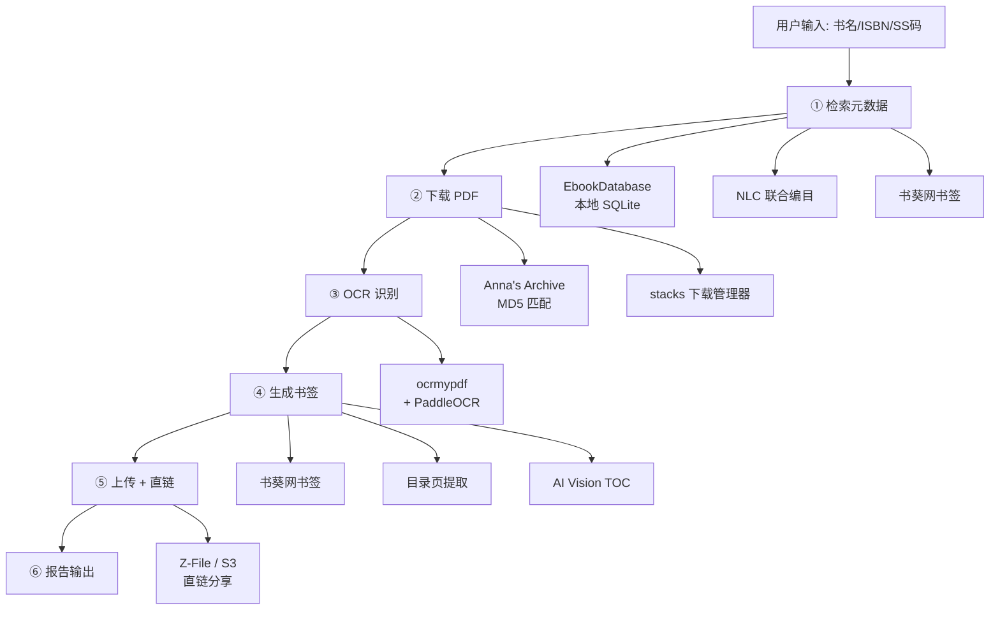

<p align="center">
  <h1 align="center">📚 Agent Ebook Downloader</h1>
</p>

<p align="center">
  <a href="https://python.org"></a>
  <a href="https://github.com/Callioper/agent-ebook-downloader"></a>
  <a href="https://github.com/PaddlePaddle/PaddleOCR"></a>
  <a href="LICENSE"></a>
  <br/>
  <a href="https://github.com/Callioper/agent-ebook-downloader"></a>
  <a href="https://github.com/Callioper/agent-ebook-downloader"></a>
</p>

<p align="center">
  <b>6 步骤电子书下载自动化管道。<br/>从书名/ISBN/SS 码出发，输出带 OCR 文字层和多级书签的 PDF + 分享直链。</b>
</p>

---

## 📑 目录

- [✨ 功能特性](#-功能特性)
- [🏗️ 架构](#️-架构)
- [🚀 快速开始](#-快速开始)
- [⚙️ 配置](#️-配置)
- [🛠️ 技术栈](#️-技术栈)
- [📁 仓库文件结构](#-仓库文件结构)
- [🎯 这个 Skill 做什么](#-这个-skill-做什么)
- [📋 前置依赖](#-前置依赖)
- [🔬 核心发现](#-核心发现)
- [❓ 常见问题排查](#-常见问题排查)
- [🖥️ 完整应用版本](#️-完整应用版本推荐)
- [🙏 致谢](#-致谢)
- [📝 版本历史](#-版本历史)

---

## ✨ 功能特性

<table>
  <tr>
    <td width="50%">

**🔍 智能检索**  
本地 EbookDatabase 模糊搜索 → NLC 联合编目校验 → 书葵网书签获取，无数据库时降级为纯 Anna's Archive 搜索

**⚙️ OCR 文字层**  
ocrmypdf + PaddleOCR（`--jobs 1` 防乱码），自动验证 CJK 文字比率，已有文字层则跳过

**📤 上传分享**  
Z-File / S3 等文件存储 + 直链生成，支持内网穿透外网分享

**🛡️ 失败恢复**  
每步均有降级方案，网络中断、OCR 失败、书签异常均可自动恢复或跳过

    </td>
    <td width="50%">

**📥 多源下载**  
Anna's Archive MD5 精确匹配 → stacks 下载管理器排队，无 stacks 时尝试 curl 直链下载

**📑 智能书签**  
书葵网书签优先 → 降级A（仅目录页）→ 降级B（AI Vision），自动推断层级结构

**📋 结构化报告**  
每次下载完成后输出标准化报告，包含 ISBN、文件大小、OCR 状态等元数据

**🔧 零基础设施可跑**  
搜索→下载→OCR 核心闭环无需任何本地服务，详见 `references/evaluation-cases.md`

    </td>
  </tr>
</table>

---

## 🏗️ 架构



### ⚡ 处理流程

| 步骤 | 说明 |
|:----:|------|
| **① 检索元数据** | 输入书名/ISBN/SS码 → 本地 DB 模糊搜索 → NLC 校验 → 书葵网取书签（无数据库时降级为纯 Anna's Archive 搜索） |
| **② 下载 PDF** | Anna's Archive 搜 MD5 → stacks 下载管理器排队（无 stacks 时尝试 curl 直链下载） |
| **③ OCR 识别** | ocrmypdf + PaddleOCR（`--jobs 1` 防乱码）→ 验证 CJK 文字比率（已有文字层则跳过） |
| **④ 生成书签** | 书葵网书签优先 → 降级A（仅目录页）→ 降级B（AI Vision），脚本：`scripts/inject_bookmarks.py` |
| **⑤ 上传 + 直链** | 可选，无后端则跳过，支持 Z-File / S3 等 |
| **⑥ 报告输出** | config.yaml 打码展示后按 `report-template.md` 输出结构化报告 |

---

## 🚀 快速开始

### 🤖 方式一：AI Agent 一键安装（推荐）

将下面这段话原样发给你的 AI Agent：

> 帮我安装 ebook-downloader。仓库地址：https://github.com/Callioper/agent-ebook-downloader
>
> 1. 把整个仓库 clone 到你能读取的 skills 目录——不只要 SKILL.md，scripts/ 和 references/ 也要。
> 2. 装完运行 `python3 scripts/parse_bookmark_hierarchy.py`，确认能输出测试结果。
> 3. 引导我完成功能选配：逐项问数据库、下载管理器、OCR、书签、上传、通知——每项只问一遍，有就给对接命令，没有就给降级方案。
> 4. 输出环境变量模板和使用指南（包含启动下载、单步操作、首次测试、预期输出的示例），让我保存。

### 📦 方式二：命令行安装（支持 skills 的 Agent）

```bash
npx skills add Callioper/agent-ebook-downloader
```

适用于 Claude Code、Codex、Cursor、Windsurf 等 50+ 种 Agent。

### 💻 方式三：手动安装

```bash
git clone https://github.com/Callioper/agent-ebook-downloader.git
cd agent-ebook-downloader

cp config.yaml.example config.yaml
# 编辑 config.yaml 填入你的环境参数

python3 scripts/parse_bookmark_hierarchy.py  # 验证安装
```

### ✅ 验证安装

1. 运行 `python3 scripts/parse_bookmark_hierarchy.py` 输出 4 组测试，确认 scripts/ 完整
2. 对 Agent 说「列出 ebook-downloader 的步骤」，应输出 6 步管道

<details>
<summary>🔧 安装故障快速排查</summary>

| 症状 | 原因 | 解决方案 |
|:---|:---|:---|
| `npx skills: command not found` | Node.js 版本太低 | 需要 ≥ 18，运行 `node --version` 确认后升级 |
| `git clone` 权限拒绝 | 仓库地址不对或 SSH 没配 key | 确认 HTTPS 地址在浏览器能打开，改用 HTTPS |
| Agent 不识别 skill | SKILL.md 没放在正确的目录 | 去看 `npx skills list` 或手动检查文件路径 |
| GitHub 克隆超时 | 网络问题 | 先 `git clone` 到本地再 `npx skills add ./local-path` 安装 |

</details>

---

## ⚙️ 配置

将 `config.yaml.example` 复制为 `config.yaml`，填入你的环境参数。运行 `python3 scripts/config_reader.py` 确认配置状态。

<details>
<summary>📋 完整配置项列表</summary>

| 分类 | 配置项 | 说明 | 默认值 |
|:---|:---|:---|:---|
| **数据库** | EbookDatabase 地址 | 本地 SQLite 数据库 | `http://127.0.0.1:10223` |
| **下载** | 下载管理器地址 | stacks Docker 服务 | `http://127.0.0.1:7788` |
| | 下载 API Key | stacks 认证密钥 | 必需 |
| **OCR** | mineru.enabled | 启用 MinerU 高精度模式 | `false` |
| | mineru.webui_url | MinerU WebUI 地址 | `http://127.0.0.1:7860` |
| | mineru.api_url | MinerU API 地址 | `http://127.0.0.1:8000` |
| **通知** | notify.enabled | 启用通知 | `false` |
| | notify.channel | 通知渠道 | `qqbot` / `telegram` / `feishu` / `none` |
| **代理** | proxy.http | HTTP 代理地址 | 空 |
| | proxy.https | HTTPS 代理地址 | 空 |
| | proxy.no_proxy | 不走代理的地址列表 | `127.0.0.1,localhost` |

</details>

### 📝 配置示例

```yaml
# config.yaml（从 config.yaml.example 复制后填入实际值）
ebookdb:
  url: "http://127.0.0.1:10223"

download_manager:
  url: "http://127.0.0.1:7788"
  api_key: "sk-xxxxxxxx"          # 必需：stacks Admin API Key

# 可选：MinerU 高精度 OCR（不配则默认用 ocrmypdf+PaddleOCR）
mineru:
  enabled: false
  webui_url: "http://127.0.0.1:7860"
  api_url: "http://127.0.0.1:8000"

# 可选：通知（管道完成时发送报告）
notify:
  enabled: false
  channel: "none"                 # qqbot / telegram / feishu / none

# 可选：代理（国内网络需要）
proxy:
  http: ""
  https: ""
  no_proxy: "127.0.0.1,localhost"
```

---

## 🛠️ 技术栈

| 类别 | 技术 |
|:---|:---|
| **Agent 框架** | SKILL.md 指令文件，支持 50+ 种 AI Agent |
| **脚本语言** | Python 3.10+ |
| **PDF 处理** | PyMuPDF (fitz) · OCRmyPDF · pikepdf |
| **OCR 引擎** | PaddleOCR (PP-OCRv5) · ocrmypdf-paddleocr |
| **书签处理** | pikepdf · PyMuPDF · 自研层级推断引擎 |
| **数据源** | EbookDatabase (SQLite) · Anna's Archive · NLC · 书葵网 |
| **下载管理** | stacks (Docker) · FlareSolverr · curl |
| **文件存储** | Z-File · S3 · Nextcloud · MinIO |
| **配置管理** | YAML · 环境变量 |

---

## 📁 仓库文件结构

```
ebook-downloader/
├── SKILL.md                          # 核心：Agent 加载的指令文件
├── README.md                         # 本文件：安装/配置/排错指南
├── config.yaml.example               # 配置文件模板
├── .gitignore
├── scripts/
│   ├── config_reader.py              # 配置读取模块
│   ├── parse_bookmark_hierarchy.py   # 书签层级推断引擎
│   └── inject_bookmarks.py           # 书签注入引擎
└── references/
    ├── evaluation-cases.md           # 评测用例 + 最小可跑路径
    ├── step6-config-check.md         # 渠道配置检查参考
    ├── report-template.md            # 结构化报告模板
    ├── setup-guide.md                # 功能选配引导
    ├── bookmark-troubleshooting.md   # 书签问题自助手册
    ├── download-troubleshooting.md   # 下载错误分类排查
    └── ghostscript-ocr-corruption.md # Ghostscript 摧毁 OCR 文字层实证
```

> **💡 核心文件说明**：`SKILL.md` 是 Agent 真正读取的指令文件，包含 6 步管道的完整定义——每步的命令、I/O 契约、失败处理方案。Agent 加载它后就知道如何编排整个下载流程。

> **💡 脚本与参考**：`scripts/` 下两个 Python 脚本可独立运行。`references/` 下按用途分三类——部署相关（`evaluation-cases.md`、`setup-guide.md`）、排查相关（`bookmark-troubleshooting.md`、`download-troubleshooting.md`、`ghostscript-ocr-corruption.md`）、格式相关（`report-template.md`）。首次部署建议从 `evaluation-cases.md` 的零基础设施路径开始。

---

## 🎯 这个 Skill 做什么

Agent 加载此 skill 后，说「下载 《书名》」「检索并下载 ISBN xxx」或「用 SS 码 xxx 下载」都会触发以下管道：

```
用户说「下载 《形而上学的巴别塔」」
    │
    ▼
┌─────────────────┐
│ ① 检索元数据    │  本地 DB 模糊搜索 → NLC 校验 → 书葵网取书签
│ 输出：书名/ISBN/ │  无数据库时降级为纯 Anna's Archive 搜索
│ SS码/书签文本    │
└────────┬────────┘
         ▼
┌─────────────────┐
│ ② 下载 PDF      │  Anna's Archive 搜 MD5 → stacks 下载管理器排队
│ 输出：本地 PDF   │  无 stacks 时尝试 curl 直链下载
└────────┬────────┘
         ▼
┌─────────────────┐
│ ③ OCR           │  ocrmypdf + PaddleOCR（--jobs 1 防乱码）
│ 输出：可搜索 PDF │  后验证 CJK 文字比率（已有文字层则跳过）
└────────┬────────┘
         ▼
┌─────────────────┐
│ ④ 生成书签      │  书葵网书签优先 → 降级A（仅目录页）→ 降级B（AI Vision）
│ 输出：带书签 PDF │  脚本：scripts/inject_bookmarks.py
└────────┬────────┘
         ▼
┌─────────────────┐        ┌───────────────────────────┐
│ ⑤ 上传 + 直链   │        │ ⑥ 渠道配置状态检查 + ⑦ 报告  │
│ 可选：无后端则跳过│   →   │ config.yaml 打码展示后      │
│ Z-File / S3 等  │        │ 按 report-template.md 输出  │
└─────────────────┘        └───────────────────────────┘
```

---

## 📋 前置依赖

### 你必须自建的基础设施

| 步骤 | 需要什么 | 推荐方案 |
|:---|:---|:---|
| ① 检索 | 图书元数据来源 | [EbookDatabase](https://github.com/Hellohistory/EbookDatabase) Docker 或本地 SQLite |
| ① 检索 | 书签数据源 | [书葵网 shukui.net](https://shukui.net) 爬虫 |
| ② 下载 | 下载管理器 | [stacks](https://github.com/annas-archive/stacks) Docker（含 FlareSolverr） |
| ② 下载 | 外网代理（中国大陆） | Clash/V2Ray（127.0.0.1:7890） |
| ③ OCR | ocrmypdf | `pip install ocrmypdf ocrmypdf-paddleocr` |
| ③ OCR | PaddleOCR | `pip install paddlepaddle paddleocr` |
| ③ OCR | PDF 文字层检测 | `pip install PyMuPDF` |
| ④ 书签 | 书签注入 | `pip install pikepdf PyMuPDF` |
| ④ 书签 | 层级推断 | 本仓库自带 `scripts/parse_bookmark_hierarchy.py`（纯 Python，无外部依赖） |
| ④ 书签 | 图片转换（PDG→PDF） | `pip install Pillow` |
| ⑤ 上传 | 文件存储 + 直链 | [Z-File](https://github.com/zhaojun1998/zfile) / Nextcloud / MinIO |
| ⑤ 上传 | 内网穿透（外网分享） | [cpolar](https://cpolar.com) / Cloudflare Tunnel / frp |
| ⑥ 报告 | 消息通道 | qqbot / telegram / feishu |

---

## 🔬 核心发现

几个在实战中验证过的关键结论，避免踩坑：

> **🔑 MD5 格式**：EbookDatabase 的 `second_pass_code` 不是 Anna's Archive 可用的 MD5 格式，下载必须从 Anna's Archive 搜索页直接提取 32 位十六进制 MD5。

> **⚠️ PaddleOCR 多线程**：PaddleOCR 在多线程下（`--jobs > 1`）会 100% 静默产生乱码，强制 `--jobs 1` 是 OCR 命令里最重要的一行。

> **🚫 Ghostscript**：Ghostscript 的 `pdfwrite` 会彻底摧毁 CJK 文字层——207 页中文 PDF 实测全部 CJK=0，完整实证见 `references/ghostscript-ocr-corruption.md`，压缩只能用 `ocrmypdf --optimize 1` 或 `qpdf --recompress-flate`。

> **📑 书签层级**：书葵网书签是扁平文本没有缩进，必须用命名规则推断层级（"第X部分 > 第X章 > 第X节 > 一、"），旧的 Tab 缩进法完全无效。

---

## ❓ 常见问题排查

如果管道在某一步中断，下面是按步骤组织的排查指南。

<details>
<summary><b>🔍 步骤①：检索元数据失败</b></summary>

1. 确认数据源可用：`curl http://localhost:10223/search?q=测试`
2. 如果返回空或超时，检查数据库服务是否在运行
3. 如果数据库正常但搜不到结果，去掉书名中的标点符号重试
4. NLC 主要收录学术专著（政府出版物、外文原版书等），通俗小说、网络文学通常查不到

</details>

<details>
<summary><b>📥 步骤②：下载 PDF 失败</b></summary>

**Anna's Archive 搜索返回空或超时：**
1. 确认代理环境变量已设置：`echo $http_proxy` 和 `echo $https_proxy`
2. 测试代理连通性：`curl -x http://127.0.0.1:7890 https://annas-archive.gd`
3. 如果代理正常但仍超时，可能是 Anna's Archive 维护中，等待 1-2 小时

**下载管理器不响应：**
1. 运行 `docker ps | grep stacks` 确认容器在跑
2. 如果没在跑，`docker start stacks` 启动它

**下载完成但文件是 `.zip`：**
1. 用 `file downloaded_file` 检查真实类型——可能是纯 PDF 被错误命名
2. 如果是 ZIP 包含 PDG/JPG 图片序列，用 Pillow + PyMuPDF 逐页合成

</details>

<details>
<summary><b>🔤 步骤③：OCR 识别失败</b></summary>

**中文文字层全是乱码：**
1. 99% 的情况是因为 `--jobs` 参数 > 1，强制使用 `--jobs 1`
2. 如果仍然乱码，检查 PaddleOCR 版本，降级到 2.8.x 试试
3. 大 PDF（>500 页）OOM 时用 `--pages 1-50`、`--pages 51-100` 分批 OCR

**Ghostscript 摧毁 OCR 文字层：** 完整实证见 `references/ghostscript-ocr-corruption.md`

**`KeyError: 'text_word_region'` 或 `ZeroDivisionError`：**
1. PaddleOCR 2.9.1+ API 变更，降级到 2.8.x 或更新 ocrmypdf-paddleocr 适配层
2. `ZeroDivisionError` 通常是 PDF 元数据 DPI=0

> **⚠️ WSL2 用户注意**：WSL2 的 systemd 会自动清理 `/tmp`，OCR 中间文件可能被删除。建议将工作目录设为 `~/tmp/ocrmypdf` 而非 `/tmp`。

</details>

<details>
<summary><b>📑 步骤④：书签注入失败</b></summary>

1. pikepdf 报 `PdfError`：用 `qpdf --decrypt input.pdf output.pdf` 移除限制后重试
2. 书签页码对不上：检查 PDF 的前几页是否是非正文内容（封面、目录、前言），调整罗马数字页偏移量
3. 完整排查指南见 `references/bookmark-troubleshooting.md`

</details>

<details>
<summary><b>📤 步骤⑤：上传与直链失败</b></summary>

1. 上传返回 401/403：确认 `UPLOAD_TOKEN` 值完整，Cookie 有效期短需重新登录
2. 直链生成后外网打不开：检查 cpolar/frp 进程，免费隧道域名可能不固定

</details>

<details>
<summary><b>🔧 通用调试方法</b></summary>

1. **确认基础设施存活**：逐个检查数据库、下载管理器、上传服务、代理
2. **检查网络路径**：Docker/沙盒中 `localhost` 指向容器自身，需改用 `host.docker.internal`
3. **核对环境变量**：`env | grep -E 'DOWNLOAD|UPLOAD'` 查看相关变量
4. **用已知可用输入复现**：用一个确定存在的 ISBN 跑完整管道
5. **查看 SKILL.md**：每个步骤都有详细的错误场景和处置方案

</details>

---

## 🖥️ 完整应用版本（推荐）

如果你需要可视化界面和更丰富的功能，试试 **[Ebook PDF Downloader](https://github.com/Callioper/ebook-pdf-downloader)** —— 一个完整的桌面应用，内置 React 前端 + FastAPI 后端：

- **🎨 现代化 Web UI**：React 18 + TypeScript + Tailwind CSS，WebSocket 实时进度、深色模式
- **⚙️ OCR 三引擎**：PaddleOCR（PP-OCRv5 中文主力）+ Tesseract + LLM OCR（视觉大模型，支持 LM Studio/Ollama）
- **📑 三源智能目录**：书葵网 + 豆瓣 + NLC 书签合并，AI Vision 智能 TOC 提取
- **⏯️ 任务控制**：暂停/恢复/重试/取消，OCR 实时逐页进度，任务完成提示音
- **📦 PDF 压缩**：黑白二值化压缩（pikepdf + FlateDecode），文字层完整保留
- **📥 多路下载**：Anna's Archive + Z-Library，FlareSolverr 自动绕过 Cloudflare
- **🖥️ 跨平台**：Windows 便携版 exe 开箱即用，macOS 源码运行

```
输入书名 → 多源检索 → 下载 PDF → OCR 识别（三引擎可选）→ 生成书签 → 完成
```

> **🔀 对比本项目**：完整应用版本提供可视化操作界面、更丰富的 OCR 引擎（含 LLM OCR）、PDF 压缩、Z-Library 等多路下载源、WebSocket 实时进度。本项目是 AI Agent 技能（SKILL.md），适合纯自然语言交互和自动化场景。两者可以配合使用：完整应用版本作为后端提供 REST API，Agent 版本通过自然语言调用其接口实现自动化。

### 🔌 本项目与完整应用 API 集成

| Agent 操作 | API 端点 |
|:---|:---|
| 搜索书籍 | `GET /api/v1/search?query=三体` |
| 创建下载任务 | `POST /api/v1/tasks` |
| 启动管道 | `POST /api/v1/tasks/{id}/start` |
| 查询进度 | `GET /api/v1/tasks/{id}` 或 WebSocket |
| 暂停/恢复/取消 | `POST /api/v1/tasks/{id}/pause` 等 |

> 完整应用版本的 API 文档见 [Ebook PDF Downloader README](https://github.com/Callioper/ebook-pdf-downloader)。

---

## 🙏 致谢

| 项目 | 用途 |
|:---|:---|
| [EbookDatabase](https://github.com/Hellohistory/EbookDatabase) | 本地图书元数据 SQLite 数据库 |
| [Anna's Archive](https://annas-archive.org/) | 全球图书元数据与下载源 |
| [stacks](https://github.com/annas-archive/stacks) | Anna's Archive 下载管理器 |
| [FlareSolverr](https://github.com/FlareSolverr/FlareSolverr) | Cloudflare / DDoS-Guard 自动绕过 |
| [OCRmyPDF](https://github.com/ocrmypdf/OCRmyPDF) | PDF OCR 文字层添加 |
| [PaddleOCR](https://github.com/PaddlePaddle/PaddleOCR) | 中文 OCR 识别引擎（PP-OCRv5） |
| [PyMuPDF](https://github.com/pymupdf/PyMuPDF) | PDF 渲染、文本提取、字体嵌入 |
| [pikepdf](https://github.com/pikepdf/pikepdf) | PDF 书签注入与编辑 |
| [NLCISBNPlugin](https://github.com/DoiiarX/NLCISBNPlugin) | NLC 国家图书馆 ISBN 查询 |
| [书葵网](https://www.shukui.net/) | 图书目录/书签数据源 |
| [Z-File](https://github.com/zhaojun1998/zfile) | 文件存储与直链分享 |
| [cpolar](https://cpolar.com) | 内网穿透（外网分享） |

---

## 📝 版本历史

此 skill 最初在 Hermes Agent + WSL2 环境中为中文学术图书下载开发，历经多个大版本迭代。

关键里程碑：
- **v12**：PaddleOCR 3.2.0 兼容性修复
- **v13**：ISBN 检索模式与判空保护
- **v14**：OCR 乱码防御机制的建立（发现 `--jobs > 1` 100% 产生乱码）
- **v15.1**：Ghostscript 的彻底移除（实证 `pdfwrite` 摧毁 CJK 文字层）、书签层级推断引擎的引入，作为通用参考架构公开发布

---

## 🤝 贡献

这是一个参考架构，欢迎提交适配案例、环境复现问题、改进 SKILL.md。

### 开发规范

- 提交前运行 `python3 scripts/parse_bookmark_hierarchy.py` 确认脚本正常
- 遵循现有代码风格（4 空格缩进，中文注释）
- 新增功能请更新对应的 `references/` 文档

### 问题反馈

遇到 Bug？[提交 Issue](https://github.com/Callioper/agent-ebook-downloader/issues/new) 请提供：
- 完整的错误日志
- 你的环境信息（OS、Python 版本、Agent 类型）
- 复现步骤

---

## 📄 许可

<a href="LICENSE"></a>

MIT © Agent Ebook Downloader
