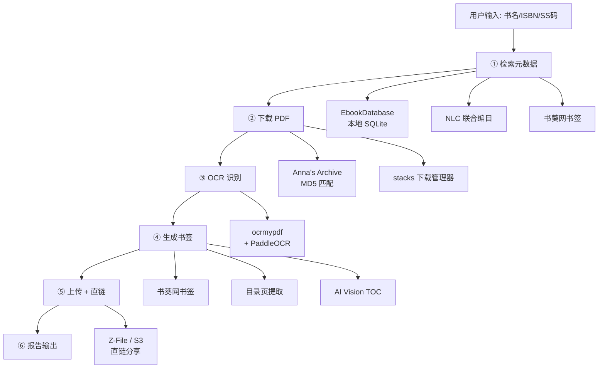

# 📚 Agent Ebook Downloader

[](https://python.org)
[]()
[](https://github.com/PaddlePaddle/PaddleOCR)
[](LICENSE)
[]()

> **6 步骤电子书下载自动化管道。从书名/ISBN/SS 码出发，输出带 OCR 文字层和多级书签的 PDF + 分享直链。**

Agent Ebook Downloader 是一个 **AI Agent 技能（Skill）**，专为自动化电子书下载管道设计。它从书名/ISBN/SS 码出发，通过检索元数据 → 下载 PDF → OCR 识别 → 书签注入 → 上传分享的完整流程，输出带 OCR 文字层和多级书签的专业 PDF。核心的搜索→下载→OCR 三步闭环不需要任何本地服务即可跑通。

> **首次使用:** 对 Agent 说「配置 ebook-downloader」，Agent 会逐项询问你的环境情况并输出定制化安装方案。

---

## ✨ 功能特性

-   **🔍 智能检索**: 本地 EbookDatabase 模糊搜索 → NLC 联合编目校验 → 书葵网书签获取，无数据库时降级为纯 Anna's Archive 搜索
-   **📥 多源下载**: Anna's Archive MD5 精确匹配 → stacks 下载管理器排队，无 stacks 时尝试 curl 直链下载
-   **⚙️ OCR 文字层**: ocrmypdf + PaddleOCR（`--jobs 1` 防乱码），自动验证 CJK 文字比率，已有文字层则跳过
-   **📑 智能书签**: 书葵网书签优先 → 降级A（仅目录页）→ 降级B（AI Vision），自动推断层级结构
-   **📤 上传分享**: Z-File / S3 等文件存储 + 直链生成，支持内网穿透外网分享
-   **📋 结构化报告**: 每次下载完成后输出标准化报告，包含 ISBN、文件大小、OCR 状态等元数据
-   **🛡️ 失败恢复**: 每步均有降级方案，网络中断、OCR 失败、书签异常均可自动恢复或跳过
-   **🔧 零基础设施可跑**: 搜索→下载→OCR 核心闭环无需任何本地服务，详见 `references/evaluation-cases.md`

---

## 🏗️ 架构



### 处理流程

1. **检索元数据**: 输入书名/ISBN/SS码 → 本地 DB 模糊搜索 → NLC 校验 → 书葵网取书签（无数据库时降级为纯 Anna's Archive 搜索）
2. **下载 PDF**: Anna's Archive 搜 MD5 → stacks 下载管理器排队（无 stacks 时尝试 curl 直链下载）
3. **OCR 识别**: ocrmypdf + PaddleOCR（`--jobs 1` 防乱码）→ 验证 CJK 文字比率（已有文字层则跳过）
4. **生成书签**: 书葵网书签优先 → 降级A（仅目录页）→ 降级B（AI Vision），脚本：`scripts/inject_bookmarks.py`
5. **上传 + 直链**: 可选，无后端则跳过，支持 Z-File / S3 等
6. **报告输出**: config.yaml 打码展示后按 `report-template.md` 输出结构化报告

---

## 🚀 快速开始

### 方式一：AI Agent 一键安装（推荐）

将下面这段话原样发给你的 AI Agent：

> 帮我安装 ebook-downloader。仓库地址：https://github.com/Callioper/agent-ebook-downloader
>
> 1. 把整个仓库 clone 到你能读取的 skills 目录——不只要 SKILL.md，scripts/ 和 references/ 也要。
> 2. 装完运行 `python3 scripts/parse_bookmark_hierarchy.py`，确认能输出测试结果。
> 3. 引导我完成功能选配：逐项问数据库、下载管理器、OCR、书签、上传、通知——每项只问一遍，有就给对接命令，没有就给降级方案。
> 4. 输出环境变量模板和使用指南（包含启动下载、单步操作、首次测试、预期输出的示例），让我保存。

### 方式二：命令行安装（支持 skills 的 Agent）

```bash
npx skills add Callioper/agent-ebook-downloader
```

适用于 Claude Code、Codex、Cursor、Windsurf 等 50+ 种 Agent。手动安装的话，`git clone https://github.com/Callioper/agent-ebook-downloader` 到你的 skills 目录即可。

### 方式三：手动安装

```bash
# 克隆仓库
git clone https://github.com/Callioper/agent-ebook-downloader.git
cd agent-ebook-downloader

# 复制配置文件
cp config.yaml.example config.yaml
# 编辑 config.yaml 填入你的环境参数

# 验证安装
python3 scripts/parse_bookmark_hierarchy.py
```

### 验证安装

1. 运行 `python3 scripts/parse_bookmark_hierarchy.py` 输出 4 组测试，确认 scripts/ 完整
2. 对 Agent 说「列出 ebook-downloader 的步骤」，应输出 6 步管道

### 安装故障快速排查

| 症状 | 原因 | 解决方案 |
|------|------|----------|
| `npx skills: command not found` | Node.js 版本太低 | 需要 ≥ 18，运行 `node --version` 确认后升级 |
| `git clone` 权限拒绝 | 仓库地址不对或 SSH 没配 key | 确认 https://github.com/Callioper/agent-ebook-downloader 在浏览器能打开，改用 HTTPS |
| Agent 不识别 skill | SKILL.md 没放在正确的目录 | 去看 `npx skills list` 或手动检查文件路径 |
| GitHub 克隆超时 | 网络问题 | 先 `git clone` 到本地再 `npx skills add ./local-path` 安装 |

---

## ⚙️ 配置

将 `config.yaml.example` 复制为 `config.yaml`，填入你的环境参数。运行 `python3 scripts/config_reader.py` 确认配置状态。

| 配置项 | 说明 | 默认值 |
|--------|------|--------|
| **数据库** | | |
| EbookDatabase 地址 | 本地 SQLite 数据库 | `http://127.0.0.1:10223` |
| **下载** | | |
| 下载管理器地址 | stacks Docker 服务 | `http://127.0.0.1:7788` |
| 下载 API Key | stacks 认证密钥 | 必需 |
| **OCR（MinerU）** | | |
| mineru.enabled | 启用 MinerU 高精度模式 | `false` |
| mineru.webui_url | MinerU WebUI 地址 | `http://127.0.0.1:7860` |
| mineru.api_url | MinerU API 地址 | `http://127.0.0.1:8000` |
| **通知** | | |
| notify.enabled | 启用通知 | `false` |
| notify.channel | 通知渠道：`qqbot` / `telegram` / `feishu` / `none` | `none` |
| **代理** | | |
| proxy.http | HTTP 代理地址 | 空 |
| proxy.https | HTTPS 代理地址 | 空 |
| proxy.no_proxy | 不走代理的地址列表 | `127.0.0.1,localhost` |

### 配置示例

```yaml
# config.yaml（从 config.yaml.example 复制后填入实际值）
ebookdb:
  url: "http://127.0.0.1:10223"

download_manager:
  url: "http://127.0.0.1:7788"
  api_key: "sk-xxxxxxxx"          # 必需：stacks Admin API Key

# 可选：MinerU 高精度 OCR（不配则默认用 ocrmypdf+PaddleOCR）
mineru:
  enabled: false
  webui_url: "http://127.0.0.1:7860"
  api_url: "http://127.0.0.1:8000"

# 可选：通知（管道完成时发送报告）
notify:
  enabled: false
  channel: "none"                 # qqbot / telegram / feishu / none

# 可选：代理（国内网络需要）
proxy:
  http: ""
  https: ""
  no_proxy: "127.0.0.1,localhost"
```

---

## 🛠️ 技术栈

| 类别 | 技术 |
|------|------|
| **Agent 框架** | SKILL.md 指令文件，支持 50+ 种 AI Agent |
| **脚本语言** | Python 3.10+ |
| **PDF 处理** | PyMuPDF (fitz), OCRmyPDF, pikepdf |
| **OCR 引擎** | PaddleOCR (PP-OCRv5), ocrmypdf-paddleocr |
| **书签处理** | pikepdf, PyMuPDF, 自研层级推断引擎 |
| **数据源** | EbookDatabase (SQLite), Anna's Archive, NLC, 书葵网 |
| **下载管理** | stacks (Docker), FlareSolverr, curl |
| **文件存储** | Z-File, S3, Nextcloud, MinIO |
| **配置管理** | YAML, 环境变量 |

---

## 仓库文件结构

```
ebook-downloader/
├── SKILL.md                          # 核心：Agent 加载的指令文件（7步骤 + I/O契约 + 失败策略）
├── README.md                         # 本文件：安装/配置/排错指南
├── config.yaml.example               # 配置文件模板（复制为 config.yaml 填入）
├── .gitignore
├── scripts/
│   ├── config_reader.py              # 配置读取模块（打码展示 + 类型安全 getter）
│   ├── parse_bookmark_hierarchy.py   # 书签层级推断引擎（栈深度模型，4种嵌套模式）
│   └── inject_bookmarks.py           # 书签注入引擎（偏移计算 + 分段检测 + 注入后验证）
└── references/
    ├── evaluation-cases.md           # 评测用例 + 最小可跑路径 + 自检清单
    ├── step6-config-check.md         # 步骤⑥ 渠道配置检查参考
    ├── report-template.md            # 步骤⑦ 结构化报告模板（成功/失败两套格式）
    ├── setup-guide.md                # 功能选配引导（6项逐项询问 → config.yaml 模板）
    ├── bookmark-troubleshooting.md   # 书签问题自助手册（7种场景排查）
    ├── download-troubleshooting.md   # 下载错误分类（临时/永久）与常见场景排查
    └── ghostscript-ocr-corruption.md # Ghostscript 摧毁 OCR 文字层实证
```

`SKILL.md` 是 Agent 真正读取的指令文件，包含 6 步管道的完整定义——每步的命令、I/O 契约、失败处理方案。Agent 加载它后就知道如何编排整个下载流程。

`scripts/` 下两个 Python 脚本可独立运行：`parse_bookmark_hierarchy.py` 无参数执行输出 4 组内置测试结果，`inject_bookmarks.py` 是完整的书签注入管线（支持 `--offset`、`--ocr`、`--toc-only` 三种模式）。

`references/` 下六个参考文件按用途分三类。部署相关：`evaluation-cases.md`（零基础设施可跑路径 + 7 个评测用例）、`setup-guide.md`（6 项逐项选配引导）。排查相关：`bookmark-troubleshooting.md`（书签 7 种场景）、`download-troubleshooting.md`（错误分类与常见场景）、`ghostscript-ocr-corruption.md`（GS 摧毁文字层实证）。格式相关：`report-template.md`（成功/失败两套汇报模板）。

首次部署建议从 `evaluation-cases.md` 的零基础设施路径开始，然后跑 `setup-guide.md` 的选配引导。

---

## 这个 Skill 做什么

Agent 加载此 skill 后，说「下载 《书名》」「检索并下载 ISBN xxx」或「用 SS 码 xxx 下载」都会触发以下管道：

```
用户说「下载 《形而上学的巴别塔」」
    │
    ▼
┌─────────────────┐
│ ① 检索元数据    │  本地 DB 模糊搜索 → NLC 校验 → 书葵网取书签
│ 输出：书名/ISBN/ │  无数据库时降级为纯 Anna's Archive 搜索
│ SS码/书签文本    │
└────────┬────────┘
         ▼
┌─────────────────┐
│ ② 下载 PDF      │  Anna's Archive 搜 MD5 → stacks 下载管理器排队
│ 输出：本地 PDF   │  无 stacks 时尝试 curl 直链下载
└────────┬────────┘
         ▼
┌─────────────────┐
│ ③ OCR           │  ocrmypdf + PaddleOCR（--jobs 1 防乱码）
│ 输出：可搜索 PDF │  后验证 CJK 文字比率（已有文字层则跳过）
└────────┬────────┘
         ▼
┌─────────────────┐
│ ④ 生成书签      │  书葵网书签优先 → 降级A（仅目录页）→ 降级B（AI Vision）
│ 输出：带书签 PDF │  脚本：scripts/inject_bookmarks.py
└────────┬────────┘
         ▼
┌─────────────────┐        ┌───────────────────────────┐
│ ⑤ 上传 + 直链   │        │ ⑥ 渠道配置状态检查 + ⑦ 报告  │
│ 可选：无后端则跳过│   →   │ config.yaml 打码展示后      │
│ Z-File / S3 等  │        │ 按 report-template.md 输出  │
└─────────────────┘        └───────────────────────────┘
```

---

## 前置依赖

### 你必须自建的基础设施

| 步骤 | 需要什么 | 推荐方案 |
|------|---------|---------|
| ① 检索 | 图书元数据来源 | [EbookDatabase](https://github.com/Hellohistory/EbookDatabase) Docker 或本地 SQLite + [NLC 联合编目 API](http://opac.nlc.cn) |
| ① 检索 | 书签数据源 | [书葵网 shukui.net](https://shukui.net) 爬虫 |
| ② 下载 | 下载管理器 | [stacks](https://github.com/annas-archive/stacks) Docker（含 FlareSolverr）或自建队列 |
| ② 下载 | 外网代理（中国大陆） | Clash/V2Ray（127.0.0.1:7890） |
| ③ OCR | ocrmypdf | `pip install ocrmypdf ocrmypdf-paddleocr` |
| ③ OCR | PaddleOCR | `pip install paddlepaddle paddleocr` |
| ③ OCR | PDF 文字层检测 | `pip install PyMuPDF`（`import fitz`） |
| ④ 书签 | 书签注入 | `pip install pikepdf PyMuPDF` |
| ④ 书签 | 层级推断 | 本仓库自带 `scripts/parse_bookmark_hierarchy.py`（纯 Python，无外部依赖） |
| ④ 书签 | 图片转换（PDG→PDF） | `pip install Pillow` |
| ⑤ 上传 | 文件存储 + 直链 | [Z-File](https://github.com/zhaojun1998/zfile) / Nextcloud / MinIO |
| ⑤ 上传 | 内网穿透（外网分享） | [cpolar](https://cpolar.com) / Cloudflare Tunnel / frp |
| ⑥ 报告 | 消息通道 | qqbot / telegram / feishu |

---

## 核心发现

几个在实战中验证过的关键结论，避免踩坑：EbookDatabase 的 `second_pass_code` 不是 Anna's Archive 可用的 MD5 格式，下载必须从 Anna's Archive 搜索页直接提取 32 位十六进制 MD5。PaddleOCR 在多线程下（`--jobs > 1`）会 100% 静默产生乱码，强制 `--jobs 1` 是 OCR 命令里最重要的一行。Ghostscript 的 `pdfwrite` 会彻底摧毁 CJK 文字层——207 页中文 PDF 实测全部 CJK=0，完整实证见 `references/ghostscript-ocr-corruption.md`，压缩只能用 `ocrmypdf --optimize 1` 或 `qpdf --recompress-flate`。书葵网书签是扁平文本没有缩进，必须用命名规则推断层级（"第X部分 > 第X章 > 第X节 > 一、"），旧的 Tab 缩进法完全无效。

## ❓ 常见问题排查

如果管道在某一步中断，下面是按步骤组织的排查指南。

<details>
<summary><b>步骤①：检索元数据失败</b></summary>

**症状：** 输入书名后返回「未找到」。

1. 确认数据源可用：`curl http://localhost:10223/search?q=测试`
2. 如果返回空或超时，检查数据库服务是否在运行
3. 如果数据库正常但搜不到结果，去掉书名中的标点符号重试
4. NLC 主要收录学术专著——通俗小说、网络文学通常查不到

</details>

<details>
<summary><b>步骤②：下载 PDF 失败</b></summary>

**症状：** Anna's Archive 搜索返回空或超时。

1. 确认代理环境变量已设置：`echo $http_proxy`
2. 测试代理连通性：`curl -x http://127.0.0.1:7890 https://annas-archive.gd`
3. 如果代理正常但仍超时，可能是 Anna's Archive 维护中，等待 1-2 小时

**症状：** 下载管理器不响应。

1. 运行 `docker ps | grep stacks` 确认容器在跑
2. 如果没在跑，`docker start stacks` 启动它
3. 参考 [stacks 部署指南](https://github.com/annas-archive/stacks)

</details>

<details>
<summary><b>步骤③：OCR 识别失败</b></summary>

**症状：** OCR 后中文文字层全是乱码。

1. 99% 的情况是因为 `--jobs` 参数 > 1，强制使用 `--jobs 1`
2. 如果仍然乱码，检查 PaddleOCR 版本，降级到 2.8.x 试试
3. 大 PDF（>500 页）OOM 时用 `--pages 1-50`、`--pages 51-100` 分批 OCR

**症状：** Ghostscript 摧毁 OCR 文字层。

完整实证见 `references/ghostscript-ocr-corruption.md`，压缩只能用 `ocrmypdf --optimize 1` 或 `qpdf --recompress-flate`。

</details>

<details>
<summary><b>步骤④：书签注入失败</b></summary>

**症状：** pikepdf 报 `PdfError` 或权限错误。

1. 用 `qpdf --decrypt input.pdf output.pdf` 移除限制后重试
2. 完整排查指南见 `references/bookmark-troubleshooting.md`

**症状：** 注入的书签页码对不上。

1. 检查 PDF 的前几页是否是非正文内容（封面、目录、前言）
2. 调整罗马数字页的偏移量

</details>

<details>
<summary><b>步骤⑤：上传与直链失败</b></summary>

**症状：** 上传返回 401/403。

1. 确认 `UPLOAD_TOKEN` 值完整
2. Cookie 认证通常只有几小时有效期，需要重新登录

**症状：** 直链生成后外网打不开。

1. 检查 cpolar/frp 进程：`ps aux | grep cpolar`
2. 免费隧道的域名可能发生变化（免费版域名不固定）

</details>

<details>
<summary><b>通用调试方法</b></summary>

1. **确认基础设施存活：** 逐个检查数据库、下载管理器、上传服务、代理
2. **检查网络路径：** Docker/沙盒中 `localhost` 指向容器自身，需改用 `host.docker.internal`
3. **核对环境变量：** `env | grep -E 'DOWNLOAD|UPLOAD'` 查看相关变量
4. **用已知可用输入复现：** 用一个确定存在的 ISBN 跑完整管道
5. **查看 SKILL.md 失败处理章节：** 每个步骤都有详细的错误场景和处置方案

</details>

---

## 🙏 致谢

| 项目 | 用途 |
|------|------|
| [EbookDatabase](https://github.com/Hellohistory/EbookDatabase) | 本地图书元数据 SQLite 数据库 |
| [Anna's Archive](https://annas-archive.org/) | 全球图书元数据与下载源 |
| [stacks](https://github.com/annas-archive/stacks) | Anna's Archive 下载管理器 |
| [FlareSolverr](https://github.com/FlareSolverr/FlareSolverr) | Cloudflare / DDoS-Guard 自动绕过 |
| [OCRmyPDF](https://github.com/ocrmypdf/OCRmyPDF) | PDF OCR 文字层添加 |
| [PaddleOCR](https://github.com/PaddlePaddle/PaddleOCR) | 中文 OCR 识别引擎（PP-OCRv5） |
| [PyMuPDF](https://github.com/pymupdf/PyMuPDF) | PDF 渲染、文本提取、字体嵌入 |
| [pikepdf](https://github.com/pikepdf/pikepdf) | PDF 书签注入与编辑 |
| [NLCISBNPlugin](https://github.com/DoiiarX/NLCISBNPlugin) | NLC 国家图书馆 ISBN 查询 |
| [书葵网](https://www.shukui.net/) | 图书目录/书签数据源 |
| [Z-File](https://github.com/zhaojun1998/zfile) | 文件存储与直链分享 |
| [cpolar](https://cpolar.com) | 内网穿透（外网分享） |

---

## 版本历史

此 skill 最初在 Hermes Agent + WSL2 环境中为中文学术图书下载开发，历经多个大版本迭代。关键里程碑包括：PaddleOCR 3.2.0 兼容性修复（v12）、ISBN 检索模式与判空保护（v13）、OCR 乱码防御机制的建立（v14，发现 `--jobs > 1` 100% 产生乱码）、Ghostscript 的彻底移除（v15.1，实证 `pdfwrite` 摧毁 CJK 文字层）、书签层级推断引擎的引入。v15.1 起作为通用参考架构公开发布。

## 贡献

这是一个参考架构，欢迎提交适配案例到适配备忘表格、报告你环境中复现的问题、或改进 SKILL.md 让它作为 Agent 指令更准确。

## 许可

MIT